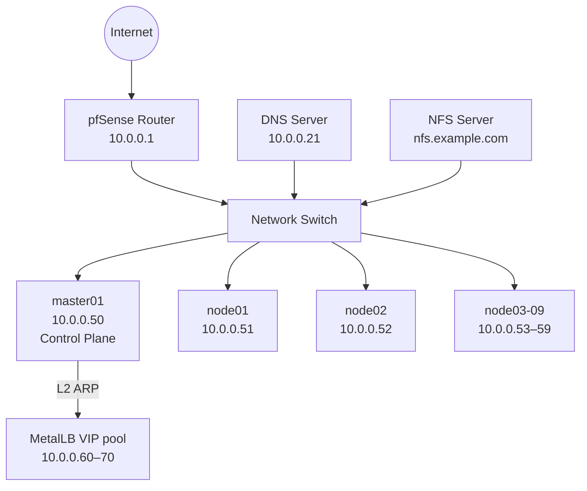
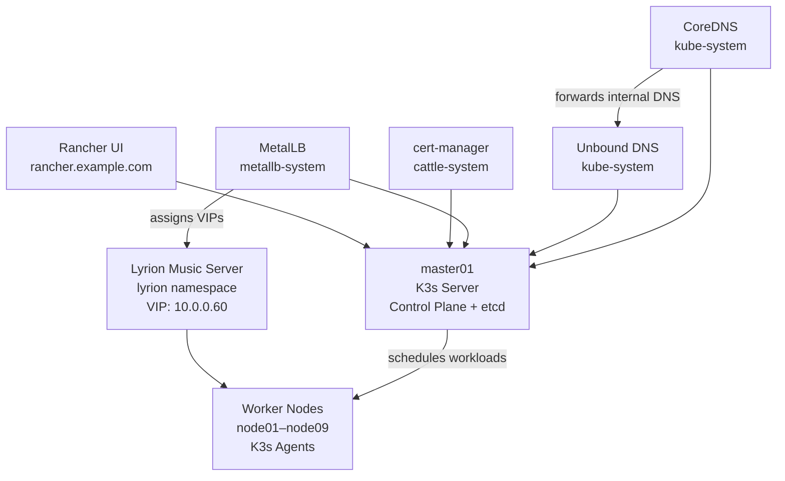
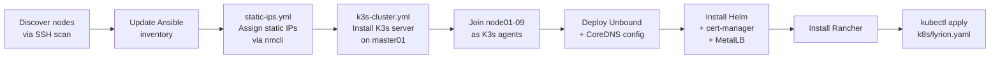

# Raspberry Pi K3s Cluster

A 10-node Kubernetes cluster running on Raspberry Pi hardware, provisioned with Ansible and managed via Rancher.

## Hardware

| Role | Hostname | IP | Count |
|---|---|---|---|
| Control Plane | master01 | 10.0.0.50 | 1 |
| Worker | node01–node09 | 10.0.0.51–59 | 9 |

All nodes run **Raspberry Pi OS Lite** (Debian 12 Bookworm, 64-bit, headless).

## Software Stack

| Tool | Purpose |
|---|---|
| [K3s](https://k3s.io) | Lightweight Kubernetes distribution |
| [Ansible](https://www.ansible.com) | Cluster provisioning and configuration |
| [Helm](https://helm.sh) | Kubernetes package manager |
| [Rancher](https://rancher.com) | Kubernetes management UI |
| [cert-manager](https://cert-manager.io) | TLS certificate management |
| [MetalLB](https://metallb.universe.tf) | Bare-metal load balancer (L2 mode) |
| [Unbound](https://nlnetlabs.nl/projects/unbound/) | Internal DNS resolver (deployed in-cluster) |
| [CoreDNS](https://coredns.io) | Kubernetes cluster DNS (k3s default, customised) |
| [NetworkManager](https://networkmanager.dev) | Static IP management on nodes |
| [Lyrion Music Server](https://lyrion.org) | Music streaming server (Squeezebox compatible) |
| [Bitwarden CLI](https://bitwarden.com/help/cli/) | Secrets management for Ansible |

## Network Architecture



## Kubernetes Architecture



## Provisioning Flow



## Repository Structure

```
.
├── ansible/
│   ├── inventory/
│   │   ├── inventory.yml            # Hosts, groups, Bitwarden lookup for become_password
│   │   └── credentials.yml.example # Credentials template (never commit the real file)
│   ├── playbooks/
│   │   ├── k3s-cluster.yml          # Full cluster bootstrap (cgroups → k3s → Rancher)
│   │   ├── static-ips.yml           # Assign static IPs via NetworkManager
│   │   └── helm-apps.yml            # Deploy additional Helm chart applications
│   └── templates/
│       ├── unbound.yaml.j2          # Unbound DNS Kubernetes manifest
│       └── coredns-custom.yaml.j2   # CoreDNS custom ConfigMap
├── k8s/
│   └── lyrion.yaml                  # Lyrion Music Server manifests (PV/PVC, Deployment, Service, Ingress)
├── scripts/
│   └── atlas-k3s-storage-setup.sh  # NFS storage setup on atlas.example.com (run as root)
└── README.md
```

## Persistent Storage

Application data is stored on `atlas.example.com` (ZFS pool: `greenlake`) and exported via NFS to the k3s subnet. Data follows the pod — not the node — so pods can be rescheduled freely without data loss.

### ZFS layout

```
greenlake/k3s/
└── lyrion/          # Lyrion config, SQLite database, artwork cache
```

Each application gets its own ZFS dataset, allowing independent snapshots, quotas, and backups per application.

### NFS export

A single export covers the entire k3s application tree:

```
/greenlake/k3s   -alldirs -maproot=root   10.0.0.0/24
```

### Setup

Run once as root on `atlas.example.com` to create datasets and configure NFS exports:

```bash
su -
sh scripts/atlas-k3s-storage-setup.sh
```

The script is idempotent. To add a new application, append it to the `apps` list in the script and re-run.


### Prerequisites

- Ansible installed on your controller machine (`pip install ansible`)
- `community.general` Ansible collection (`ansible-galaxy collection install community.general`)
- Bitwarden CLI installed and logged in (`bw login`)
- SSH key deployed to all nodes
- A Bitwarden item named `k3s-cluster` with fields: `username`, `password`, `ansible_become_password`

### Convenient wrapper

A helper script at `~/bin/k3s-ansible` unlocks Bitwarden and runs playbooks from the correct directory:

```bash
k3s-ansible k3s-cluster.yml          # full cluster bootstrap
k3s-ansible static-ips.yml           # reassign static IPs
k3s-ansible helm-apps.yml            # deploy additional Helm apps
```

### Bootstrap the cluster manually

```bash
cd ansible
bw unlock  # copy the session token, then:
export BW_SESSION=<token>
ansible-playbook -i inventory/inventory.yml playbooks/k3s-cluster.yml
```

### Assign static IPs only

```bash
ansible-playbook -i inventory/inventory.yml playbooks/static-ips.yml
```

### Deploy Lyrion Music Server

```bash
kubectl apply -f k8s/lyrion.yaml
```

> **NFS note**: The NFS server must support NFSv3. The mount option `vers=3` is set explicitly.
> The PV uses `storageClassName: ""` to prevent k3s from defaulting to local-path.

### Deploy additional Helm apps

Add entries to the `helm_apps` list in `playbooks/helm-apps.yml`, then:

```bash
k3s-ansible helm-apps.yml
```

## Accessing Rancher

Once the cluster is up, Rancher is available at:

**https://rancher.example.com**

The bootstrap password is stored in Bitwarden (`k3s-cluster` → `rancher_bootstrap_password`).

## MetalLB

MetalLB runs in L2 mode with IP pool `10.0.0.60–10.0.0.70`. It provides stable VIPs for `LoadBalancer` services.

> **Important**: k3s ships with a built-in load balancer (klipper/servicelb). This conflicts with MetalLB.
> It is disabled via `--disable servicelb` in the k3s server args (`/etc/systemd/system/k3s.service`).

| Service | VIP |
|---|---|
| Lyrion Music Server | 10.0.0.60 |
| Traefik (ingress) | 10.0.0.61 |

## Lyrion Music Server

Lyrion (formerly Logitech Media Server) streams music to Squeezebox hardware players.

- **Web UI**: http://lyrion.example.com:9000
- **Squeezebox protocol**: TCP/UDP 3483 (UDP broadcast for player discovery)
- **Music library**: NFS mount from `atlas.example.com:/greenlake/media` (read-only, NFSv3)
- **Config/database/artwork**: NFS PVC from `atlas.example.com:/greenlake/k3s/lyrion` (persistent across pod restarts)
- **VIP**: `10.0.0.60` via MetalLB — stable across pod rescheduling

> **Note**: Pod config (`/config`) will be mounted from NFS (`greenlake/k3s/lyrion`) — see Persistent Storage section above.

## Roadmap

- [ ] Dedicated cluster VLAN with pfSense routing
- [ ] Move cluster to isolated `10.1.10.x` network
- [x] Persistent storage for Lyrion config (NFS PVC on atlas — pending lyrion.yaml.j2 update)
- [ ] Update lyrion.yaml.j2 to mount /config from NFS PVC
