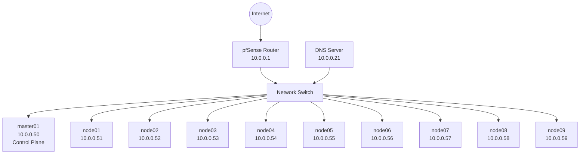
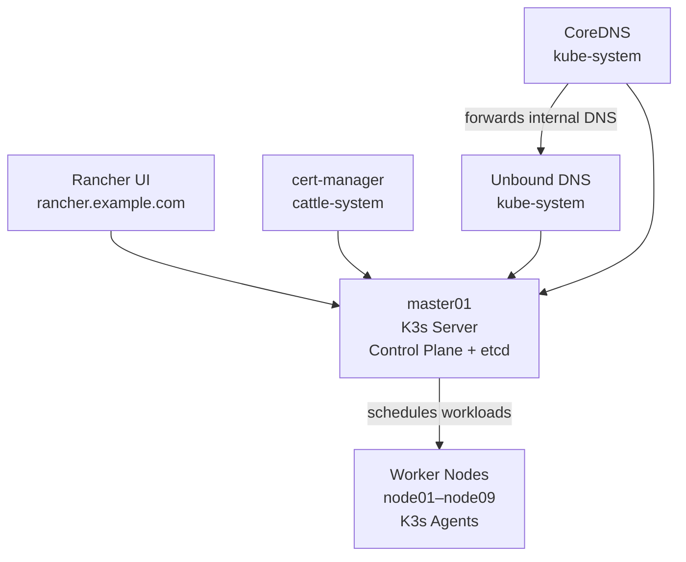
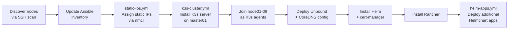

# Raspberry Pi K3s Cluster

A 10-node Kubernetes cluster running on Raspberry Pi hardware, provisioned with Ansible and managed via Rancher.

## Hardware

| Role | Hostname | IP | Count |
|---|---|---|---|
| Control Plane | master01 | 10.0.0.50 | 1 |
| Worker | node01–node09 | 10.0.0.51–59 | 9 |

All nodes run **Raspberry Pi OS Lite** (Debian 12 Bookworm, 64-bit, headless).

## Software Stack

| Tool | Purpose |
|---|---|
| [K3s](https://k3s.io) | Lightweight Kubernetes distribution |
| [Ansible](https://www.ansible.com) | Cluster provisioning and configuration |
| [Helm](https://helm.sh) | Kubernetes package manager |
| [Rancher](https://rancher.com) | Kubernetes management UI |
| [cert-manager](https://cert-manager.io) | TLS certificate management |
| [Unbound](https://nlnetlabs.nl/projects/unbound/) | Internal DNS resolver (deployed in-cluster) |
| [CoreDNS](https://coredns.io) | Kubernetes cluster DNS (k3s default, customised) |
| [NetworkManager](https://networkmanager.dev) | Static IP management on nodes |

## Network Architecture



## Kubernetes Architecture



## Provisioning Flow



## Repository Structure

```
.
├── ansible/
│   ├── inventory/
│   │   ├── inventory.yml            # Hosts and group definitions
│   │   └── credentials.yml.example # Credentials template (never commit the real file)
│   ├── playbooks/
│   │   ├── k3s-cluster.yml          # Full cluster bootstrap (cgroups → k3s → Rancher)
│   │   ├── static-ips.yml           # Assign static IPs via NetworkManager
│   │   └── helm-apps.yml            # Deploy additional Helm chart applications
│   └── templates/
│       ├── unbound.yaml.j2          # Unbound DNS Kubernetes manifest
│       └── coredns-custom.yaml.j2   # CoreDNS custom ConfigMap
└── README.md
```

## Usage

### Prerequisites

- Ansible installed on your controller machine (`pip install ansible`)
- `sshpass` installed for password-based SSH
- Copy `ansible/inventory/credentials.yml.example` to `~/credentials.yml` and fill in values

### Bootstrap the cluster

```bash
cd ansible
ansible-playbook -i inventory/inventory.yml playbooks/k3s-cluster.yml -e @~/credentials.yml
```

### Assign static IPs only

```bash
ansible-playbook -i inventory/inventory.yml playbooks/static-ips.yml -e @~/credentials.yml
```

### Deploy additional Helm apps

Add entries to the `helm_apps` list in `playbooks/helm-apps.yml`, then:

```bash
ansible-playbook -i inventory/inventory.yml playbooks/helm-apps.yml -e @~/credentials.yml
```

## Accessing Rancher

Once the cluster is up, Rancher is available at:

**https://rancher.example.com**

The bootstrap password is defined in your local `~/credentials.yml` (`rancher_bootstrap_password`).

## Roadmap

- [ ] Dedicated cluster VLAN with pfSense routing
- [ ] Move cluster to isolated `10.1.10.x` network
- [ ] MetalLB for bare-metal load balancing
- [ ] Persistent storage (NFS or Longhorn)
