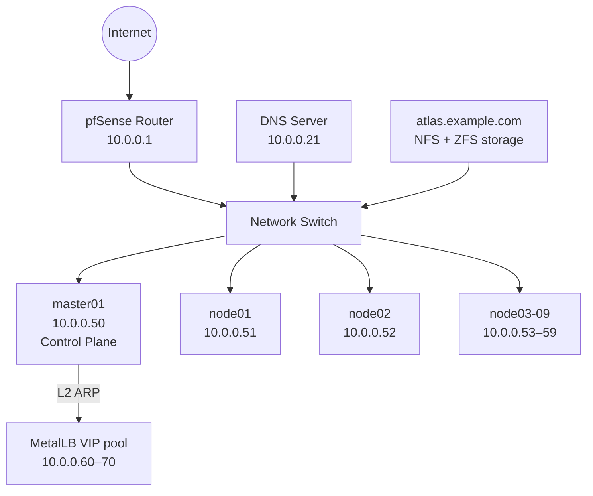
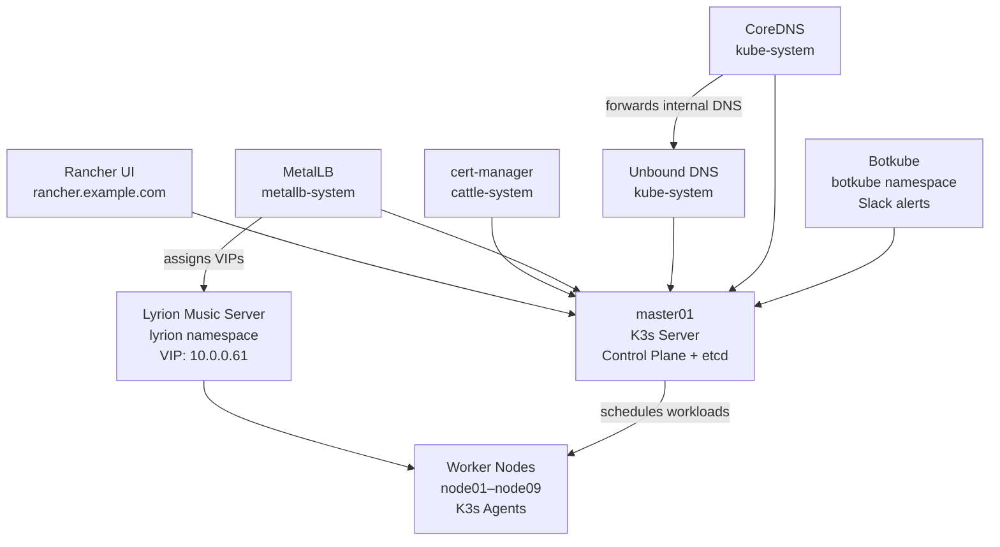

# Architecture

## Hardware

| Role | Hostname | IP | Count |
|---|---|---|---|
| Control Plane | master01 | 10.0.0.50 | 1 |
| Worker | node01–node09 | 10.0.0.51–59 | 9 |

All nodes run **Raspberry Pi OS Lite** (Debian 12 Bookworm, 64-bit, headless).

## Software Stack

| Tool | Purpose |
|---|---|
| [K3s](https://k3s.io) | Lightweight Kubernetes distribution |
| [Ansible](https://www.ansible.com) | Cluster provisioning and configuration |
| [Helm](https://helm.sh) | Kubernetes package manager |
| [Rancher](https://rancher.com) | Kubernetes management UI |
| [cert-manager](https://cert-manager.io) | TLS certificate management |
| [MetalLB](https://metallb.universe.tf) | Bare-metal load balancer (L2 mode) |
| [Unbound](https://nlnetlabs.nl/projects/unbound/) | Internal DNS resolver (deployed in-cluster) |
| [CoreDNS](https://coredns.io) | Kubernetes cluster DNS (k3s default, customised) |
| [NetworkManager](https://networkmanager.dev) | Static IP management on nodes |
| [Botkube](https://botkube.io) | Kubernetes event monitoring with Slack alerts |
| [Lyrion Music Server](https://lyrion.org) | Music streaming server (Squeezebox compatible) |
| [Bitwarden CLI](https://bitwarden.com/help/cli/) | Secrets management for Ansible |

## Network

## Kubernetes

## MetalLB

MetalLB runs in L2 mode with IP pool `10.0.0.60–10.0.0.70`. It provides stable VIPs for `LoadBalancer` services.

> **Important**: k3s ships with a built-in load balancer (klipper/servicelb) that conflicts with MetalLB.
> It is disabled via `--disable servicelb` in the k3s server args.

| Service | VIP |
|---|---|
| Rancher | 10.0.0.60 |
| Lyrion Music Server | 10.0.0.61 |
