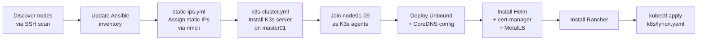

# Provisioning

## Flow



## Prerequisites

- Ansible installed on your controller machine (`pip install ansible`)
- `community.general` Ansible collection (`ansible-galaxy collection install community.general`)
- Bitwarden CLI installed and logged in (`bw login`)
- SSH key deployed to all nodes
- A Bitwarden item named `k3s-cluster` with fields: `username`, `password`, `ansible_become_password`

## Convenient wrapper

A helper script at `~/bin/k3s-ansible` unlocks Bitwarden and runs playbooks from the correct directory:

```bash
k3s-ansible k3s-cluster.yml          # full cluster bootstrap
k3s-ansible static-ips.yml           # reassign static IPs
k3s-ansible helm-apps.yml            # deploy additional Helm apps
k3s-ansible lyrion.yml               # deploy Lyrion Music Server
```

## Playbooks

### Full cluster bootstrap

```bash
cd ansible
bw unlock  # copy the session token, then:
export BW_SESSION=<token>
ansible-playbook -i inventory/inventory.yml playbooks/k3s-cluster.yml
```

### Assign static IPs only

```bash
k3s-ansible static-ips.yml
```

### Deploy additional Helm apps

Add entries to the `helm_apps` list in `playbooks/helm-apps.yml`, then:

```bash
k3s-ansible helm-apps.yml
```

## Accessing Rancher

Once the cluster is up, Rancher is available at **https://rancher.example.com**.

The bootstrap password is stored in Bitwarden (`k3s-cluster` → `rancher_bootstrap_password`).
