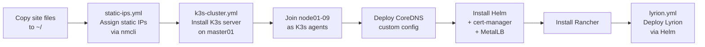

# Provisioning

## Flow



## Prerequisites

- Ansible installed on your controller machine (`pip install ansible`)
- `community.general` Ansible collection (`ansible-galaxy collection install community.general`)
- Bitwarden CLI installed and logged in (`bw login`)
- SSH key deployed to all nodes

## Site configuration

Two files must exist on your controller — they are never committed to git:

```bash
# 1. Host IPs — copy the example and fill in your real IPs
cp k3s-inventory.yml.example ~/k3s-inventory.yml

# 2. Site variables — copy the example and fill in your real values
cp k3s-site.yml.example ~/k3s-site.yml
```

`~/k3s-site.yml` covers networking, DNS, NFS paths, service hostnames, MetalLB VIPs, component version pins, and optional Helm apps. See `k3s-site.yml.example` for all available vars.

## Convenient wrapper

A helper script at `~/bin/k3s-ansible` unlocks Bitwarden and loads both site files automatically:

```bash
k3s-ansible                           # full cluster bootstrap (k3s-cluster.yml)
k3s-ansible static-ips.yml           # assign static IPs
k3s-ansible helm-apps.yml            # deploy additional Helm apps
k3s-ansible lyrion.yml               # deploy Lyrion Music Server
k3s-ansible botkube.yml              # deploy Botkube Slack monitoring
```

## Playbooks

### Full cluster bootstrap

```bash
k3s-ansible k3s-cluster.yml
```

Runs as a single playbook across all nodes:
1. **Play 1** — cgroups config + `squeezeboxserver` user on all nodes
2. **Play 2** — K3s server on master, CoreDNS custom config
3. **Play 3** — K3s agents join the cluster
4. **Play 4** — Helm, cert-manager, Rancher on master

### Assign static IPs

```bash
k3s-ansible static-ips.yml
```

Uses `dns_external_ip`, `dns_internal_ip`, and `internal_domain` from `~/k3s-site.yml`.

### Deploy additional Helm apps

Add entries to `site_helm_apps` in `~/k3s-site.yml`:

```yaml
site_helm_apps:
  - name: my-app
    chart: myrepo/my-app
    repo: myrepo
    repo_url: https://charts.example.com
    namespace: my-namespace
    version: "1.2.3"
```

Then run:

```bash
k3s-ansible helm-apps.yml
```

### Deploy Lyrion

```bash
k3s-ansible lyrion.yml
```

Requires `nfs_server`, `lyrion_vip`, `lyrion_hostname`, `lyrion_nfs_config_path`, and `lyrion_nfs_music_path` in `~/k3s-site.yml`.

### Deploy Botkube

```bash
k3s-ansible botkube.yml
```

Requires `botkube_slack_bot_token` and `botkube_slack_app_token` in `~/k3s-site.yml`. Tokens are written to a temporary file (`0600`) during deploy and cleaned up immediately — they are never passed via `--set` or stored in Helm history.

## Accessing Rancher

Once the cluster is up, Rancher is available at the hostname set in `rancher_hostname` in `~/k3s-site.yml`.

The bootstrap password is stored in Bitwarden (`k3s-cluster` → `rancher_bootstrap_password`).
